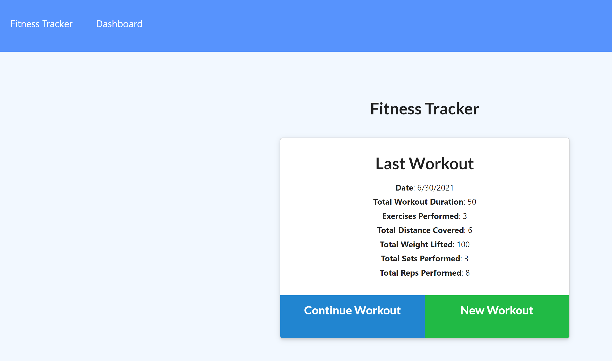

# Workout Generator

  

  ## Description
  An app that keeps track of your daily workouts and shows last 7 workout stats in the dashboard.
  
  ## Table of Contents
  - [Installation](#Installation)
  
  - [Usage](#Usage)
  
  - [License](#License)
  
  - [Contributing](#Contributing)
  
  - [Test](#Test)
  
  - [Questions](#Questions)
  
  ## Installation
  To install the required dependencies run the following command:
  
      npm i
      
  ## Usage
  Do a git pull, after installing dependencies run npm start and open local host 3001(If you want to see pre-seeded data, do an npm run seed) or go to deployed application in [Heroku](https://radiant-island-44468.herokuapp.com).
  
  Website Preview:

  

  
  ## License 
  This project is licensed under the [MIT](https://opensource.org/licenses/MIT) license.
  
  ## Contributing
  No touchy touchy.
  
  ## Test
  To run test(s), run the following command:
  
      N/A
  
  ## Questions
  If you have any questions or need to contact me directly please email me at:
  <Mary.C.McClernan@gmail.com>
  
  If you would like to see some of my other projects feel free to checkout my GitHub at:
  [MCM1015](https://github.com/MCM1015)
  